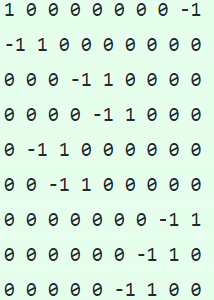

# TEORIA GRAFÓW: ALGORYTM BELLMANA - FORDA

### Algorytm Bellmana - Forda znajduje najkrótszą ścieżkę pomiędzy danymi węzłami w grafie, który nie posiada ujemnych cykli.

## 1. Uruchom program
Zainstaluj dowolny kompilator c++ oraz cmake.  
Przejdź do katalogu bellman_ford.  
Utwórz nowy katalog "build" i przejdź do niego.  
W katalogu "bellman_ford/build" wykonaj polecenie: cmake ../  
Następnie wykonaj polecenie: make  
Następnie wykonaj polecenie: make run_bellman_ford  

## 2. Wczytaj Twój graf
Program umożliwia wczytanie grafu z pliku tekstowego zawierającego listę sąsiedztwa lub macierz incydencji.  
Plik z grafem należy umieścić w folderze bellman_ford/src/graphs  
Tam znajdziesz już przykładowe grafy.  
Uwaga! Zawartość pliku musi mieć odpowiedni format:  
### Macierz incydencji:

### Lista sąsiedztwa:

### Wagi krawędzi możesz przypisać losowo, badź też wczytać z pliku.
### Plik powinien zawierać macierz wag.   Element w i-tym wierszu i j-tej kolumnie oznacza wagę krawędzi i --> j. 
### Przykładowy plik: 

### Wagi mogą też zawierać część ułamkową:

## Najpierw zdecyduj w jaki sposób chcesz wczytać swój graf:
### Aby wczytać graf z listy sąsiedztwa wybierz A:

###Aby wczytać garf z macierzy incydencji wybierz I:

## Następnie wybierz opcję przypisania wag krawędziom:
### Aby przypisać krawędziom losowe wartości wybierz R:

### Aby przypisać krawędziom wartości zawarte w pliku wybierz F:

Następnie program poprosi Cię o wpisanie nazwy pliku z reprezentacją grafu i ewentualnie nazwy pliku z wartościami krawędzi.
Pamiętaj, że musisz podać właściwą ścieżkę do pliku np. graphs/1/one_adjacency_list.txt

### Gdy graf zostanie wczytany prawidłowo otrzymasz informację o ilości wczytanych węzłów i krawędzi:

## Teraz pobaw się Twoim grafem:
Możesz wypisać jego listę sąsiedztwa lub macierz incydencji lub korzystając z algorytmu Bellmana - Forda znaleźć najkrószą ścieżkę pomiędzy węzłami (program poprosi Cię o podanie indeksu węzła początkowego i końcowego).
### Kieruj się instrukcjami!

# Przykłady:
## Graph - "ONE"
### Uwaga! Graf posiada ujemny cykl!

## Graph - "TWO"

## Graph - "THREE"

## Graph - "MY GRAPH"
### Losowe wagi krawędzi

### Program wypisze krawędzie i ich wagi:

