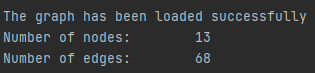

#TEORIA GRAFÓW: ALGORYTM BELLMANA - FORDA

###Algorytm Bellmana - Forda znajduje najkrótszą ścieżkę pomiędzy danymi węzłami w grafie, który nie posiada ujemnych cylki.

##1. Uruchom program
Zainstaluj dowolny kompilator c++ oraz cmake.  
Przejdź do katalogu bellman_ford.  
Utwórz nowy katalog "build" i przejdź do niego.  
W katalogu "bellman_ford/build" wykonaj polecenie: cmake ../  
Następnie wykonaj polecenie: make  
Następnie wykonaj polecenie: make run_bellman_ford  

##2. Wczytaj Twój graf
Program umożliwia wczytanie grafu z pliku tekstowego zawierającego listę sąsiedztwa lub macierz incydencji.  
Plik z grafem należy umieścić w folderze bellman_ford/src/graphs  
Tam znajdziesz już przykładowe grafy.  
Uwaga zawartość pliku musi mieć odpowiedni format:  
### Macierz incydencji:

### Lista sąsiedztwa:

### Wagi krawędzi możesz przypisać losowo, badź też wczytać z pliku.
### Plik powinien zawierać macierz wag, gdzie element w i-tym wierszu i j-tej kolumnie oznacza wagę krawędzi i --> j. 
###Przykładowy plik: 

### Wagi mogą też zawierać część ułamkową:

##Najpierw zdecyduj w jaki sposób chcesz wczytać swój graf:
###Aby wczytać graf z listy sąsiedztwa wybierz A:

###Aby wczytać garf z macierzy incydencji wybierz I:

##Następnie wybierz opcję przypisania wag krawędziom:
###Aby przypisać krawędziom losowe wartości wybierz R:

###Aby przypisać krawędziom wartości zawarte w pliku wybierz F:

Następnie program poprosi Cię o wpisanie nazwy pliku z reprezentacją grafu i ewentualnie nazwy pliku z wartościami krawędzi.
Pamiętaj, że musisz podać właściwą ścieżkę do pliku np. graphs/1/one_adjacency_list.txt

### Gdy graf zostanie wczytany prawidłowo otrzymasz informację o ilości wczytanych węzłów i krawędzi:

##Teraz pobaw się Twoim grafem:
Możesz wypisać jego listę sąsiedztwa lub macierz incydencji lub korzystając z algorytmu Bellmana - Forda znaleźć najkrószą ścieżkę pomiędzy węzłami (program poprosi Cię o podanie indeksu węzła początkowego i końcowego).
###Kieruj się instrukcjami!

#Przykłady:
##Graph - "ONE"
###Uwaga! Graf posiada ujemny cykl!

##Graph - "TWO"

##Graph - "THREE"

##Graph - "MY GRAPH"
###Losowe wagi krawędzi

###Program wypisze krawędzie i ich wagi:

